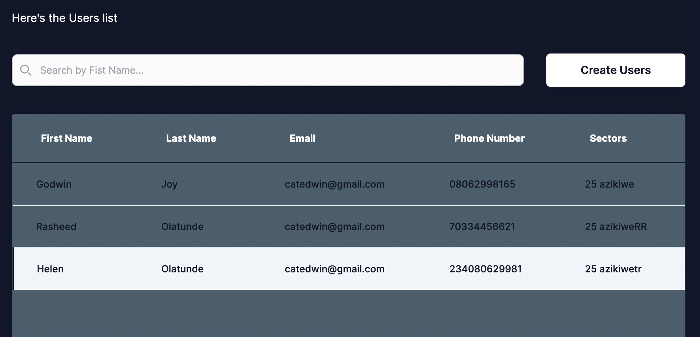

<h1>Sector Web Application</h1>
<h6><i>Enjoy your sector web application</i></h6>

Hello, 👋 \
Sector Web Application allows user to perform any CRUD operation.

Here's some notes about my submission:

1. A link to the Frontend repository   https://github.com/RuchiDeve/sector-app

2. A link to the Backend repository(Java) https://github.com/RuchiDeve/SectorApi.git

3. A publicly live hosted URL of the challenge  https://uruchi-sector-app.vercel.app/

Thank you very much.

Best regards,\
Uruchi Okezie

# Technologies 
 + [Java](https://dev.java/)
 + [Typescript](https://www.typescriptlang.org/) 
 + [JavaScript](https://javascript.info/) 
 + [NextJs](https://nextjs.org/)
 + [Vercel](https://vercel.com/dashboard) 
 + [React Hook-form](https://react-hook-form.com/) 
 + [TailwindCss](https://tailwindcss.com/) 
 + [Postgres](https://www.postgresql.org/docs/) 

# Prototype

 
# How to Contribute

1. Clone the repository 
$ git clone [https://github.com/RuchiDeve/sector-app](https://github.com/RuchiDeve/sector-app)

2. Change directory into the cloned folder and run the setup script
$ cd sector-app

3. Open your terminal and type this command `yarn install ` or `npm install` to add the react dependency to the app in the development mode.

4. Then after the installation of the  dependency type this command  `yarn dev` to run the app in your local environment 

5. Copy this link [http://localhost:3000/](http://localhost:3000/) and paste it to your web browser(Chrome, safari, mozilla firefox et.c) to view it.

# Deployment
Vercel was used to deploy the app. 
 + [Vercel](https://vercel.com/dashboard) - Frontend deployment
 + [Render](https://dashboard.render.com/) - Backend deployment

# License
The MIT License - Copyright (c) 2023 - Present, uruchi/  Storage Service.

# Author
Uruchi Okezie (Full Stack Developer)
